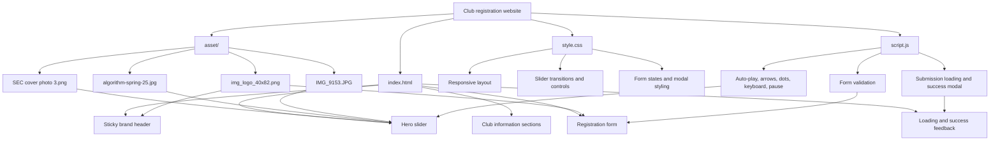

# Software Engineering Club Site — Knowledge Graph

## Purpose

This vanilla front-end presents the Software Engineering Club, explains its activities, and collects membership registrations.

## Graph

## Runtime relationships

- `index.html` is the only page and loads `style.css` plus `script.js`.
- The hero uses all three large images from `asset/`; JavaScript changes the active slide every five seconds.
- Slider arrows, dots, left/right keyboard keys, hover, and focus provide manual control.
- The logo is reused in the sticky site header and registration form header.
- The registration form remains client-side and does not send data to a server.

## Constraints

- HTML5, CSS3, and browser JavaScript only.
- No framework, build tool, package dependency, or external slider library.
- Local images are the visual source of truth.
